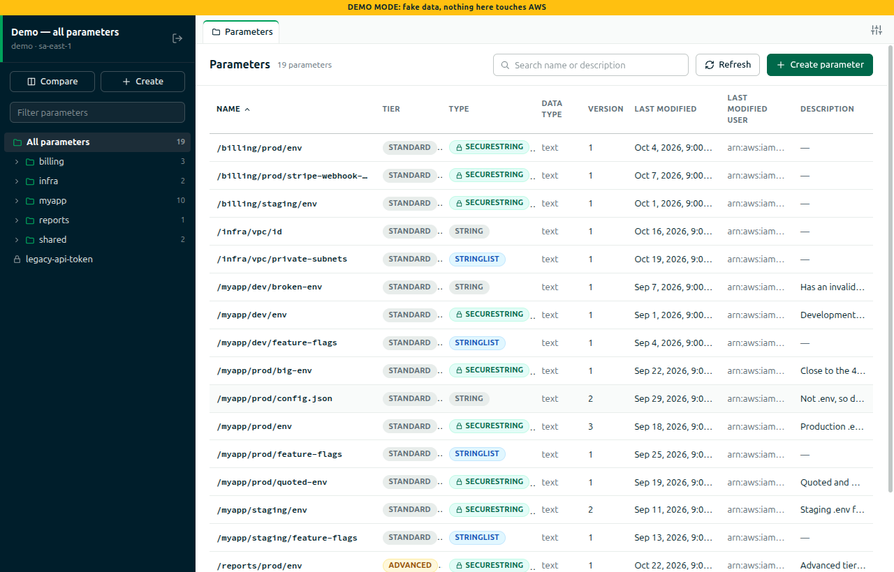
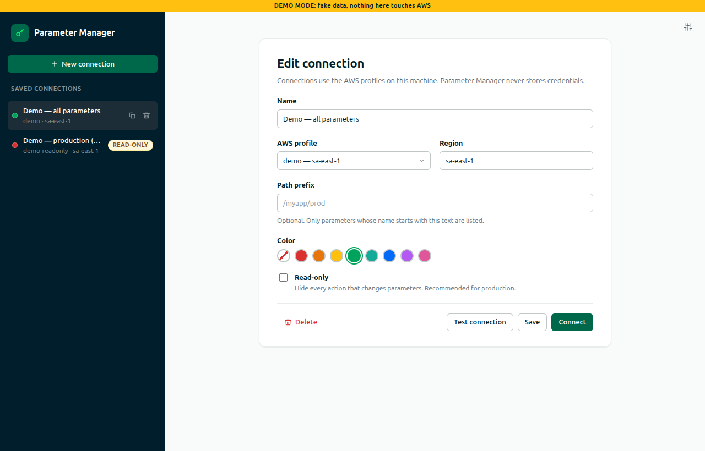
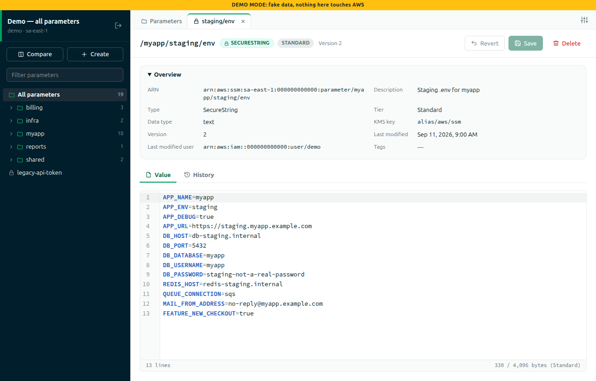
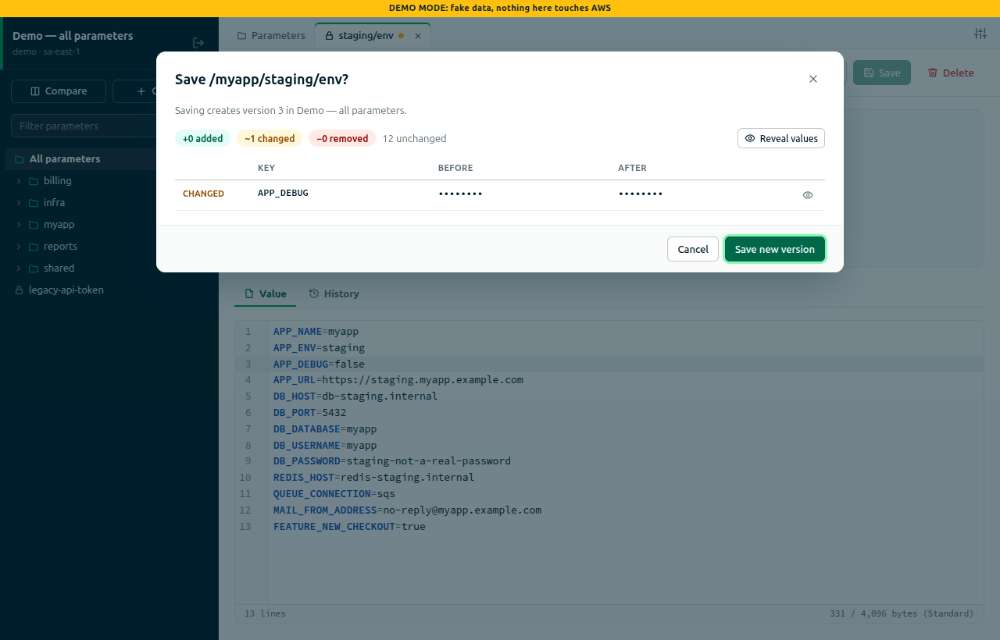
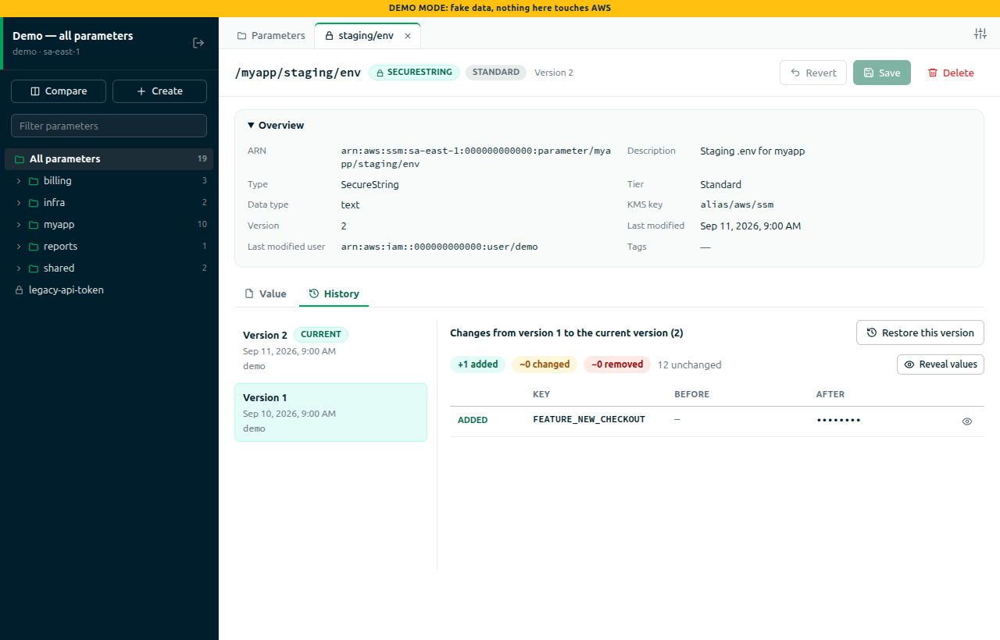
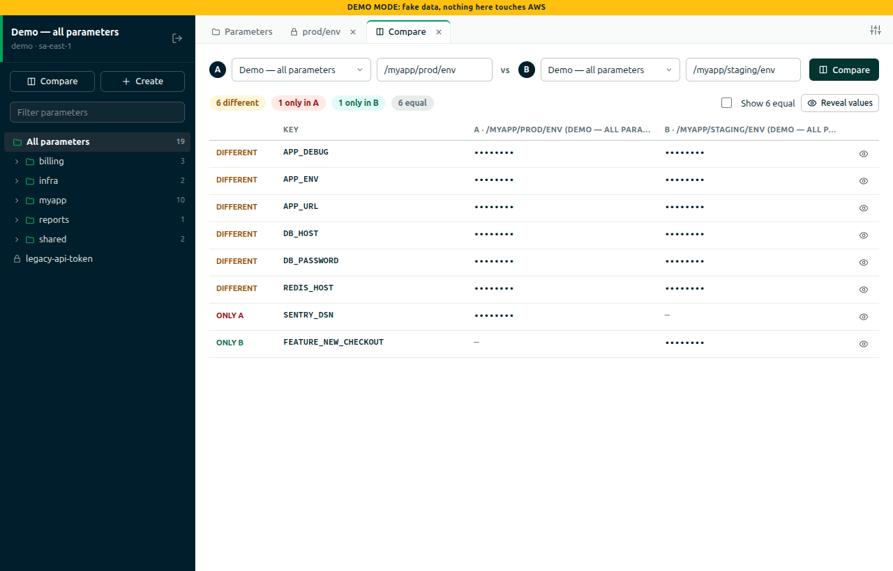
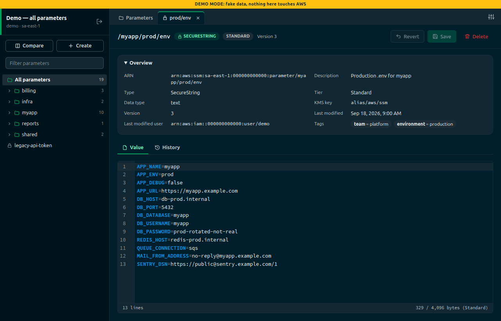

# Parameter Manager

A desktop client for **AWS Systems Manager Parameter Store**.
It lists every parameter with the same columns as the AWS console and edits values as `.env` text.
It shows a diff before every save, browses version history, and compares two parameters, even
across AWS accounts.

It is written in plain JavaScript (no TypeScript, no UI framework) on Electron, electron-vite,
CodeMirror 6, and the AWS SDK for JavaScript v3.



## Contents

- [Features](#features)
- [Screenshots](#screenshots)
- [Requirements](#requirements)
- [Getting started](#getting-started)
- [Using the app](#using-the-app)
- [Scripts](#scripts)
- [How saving works](#how-saving-works)
- [Architecture](#architecture)
- [IAM permissions](#iam-permissions)
- [Security](#security)
- [Testing](#testing)
- [Packaging](#packaging)
- [Manual checklist against real AWS](#manual-checklist-against-real-aws)
- [Design decisions](#design-decisions)
- [Known limitations](#known-limitations)

## Features

- **Saved connections.** Each connection is an AWS profile plus a region, an
  optional path prefix, a color, and an optional **read-only** flag.
- **A parameter list with the AWS console's columns:** Name, Tier, Type, Data type, Version,
  Last modified, Last modified user, and Description. It has search, sorting, and a path tree
  in the sidebar.
- **A `.env` editor** (CodeMirror 6) with syntax highlighting, warnings for invalid lines and
  duplicate keys, and a byte counter against the tier limit.
- **A diff before every save**, key by key. Values are masked until you reveal them.
- **Version history**, with a diff against the current value and **Restore**.
- **Create and delete.** Deleting requires typing the full parameter name.
- **Compare** two parameters, for example staging vs production, across connections.
- **Light and dark themes**, or follow the system.
- **Demo mode** with fake data, which never touches AWS.

## Screenshots

All screenshots use demo mode, so the data is fake.

| | |
| --- | --- |
|  |  |
| **Connections**: saved AWS profiles, regions, and prefixes | **Editor**: a `.env` value with highlighting and a byte counter |
|  |  |
| **Save**: the key-by-key diff, with values masked | **History**: every version, diffed against the current value |
|  |  |
| **Compare**: two parameters, even across accounts | **Dark theme** |

## Requirements

- Node.js 20.19 or newer
- AWS profiles in `~/.aws/config` and/or `~/.aws/credentials`. Static keys and SSO both work.

## Getting started

```bash
npm install
npm run demo   # fake in-memory data, never touches AWS
npm run dev    # real AWS, using your local profiles
```

1. Create a **connection**: a name, an AWS profile, a region, an optional path prefix, a color,
   and optionally **Read-only**. Read-only is recommended for production.
2. **Connect** to browse parameters. Click a row or a tree leaf to open it in a tab.
3. Edit the value and press **Ctrl+S**. Review the diff and save a new version.

## Using the app

### Connections

- The left column lists saved connections. Click one to edit it, and double-click it (or press
  Enter) to connect. The row icons duplicate or delete a connection.
- The **AWS profile** list is read from your AWS config and credentials files. SSO profiles
  are marked "(SSO)".
- Choosing a profile fills in its default region, unless you have already typed a different
  one.
- **Test connection** checks that the profile can list parameters in the region.
- **Connect** saves pending edits first. For a new connection the button reads
  **Save & connect**.
- **Path prefix** limits the list to names that start with that text, for example
  `/myapp/prod`.
- **Read-only** hides every action that changes parameters. The main process also refuses
  writes for read-only connections, so a UI bug cannot write.

### Workspace

- **Sidebar.**
  - The connection header has a disconnect button.
  - **Compare** and **Create** buttons sit below it.
  - A filter box and the parameter tree come next. Names are split on `/` into folders;
    names without a leading `/` appear at the top level.
  - Clicking a folder filters the table to it, and clicking a leaf opens the parameter.
- **Tabs.** A fixed **Parameters** tab, plus one tab per open parameter or comparison.
  - A yellow dot marks unsaved changes.
  - Closing a tab with unsaved changes asks first, and so do disconnecting and closing the
    window.
- **Parameters tab.**
  - Search covers name and description.
  - Every column header sorts.
  - **Refresh** reloads the list.
  - The table renders 500 rows at a time and has a **Show more** button. Search and sort
    always cover every row.

### Parameter tab

- The header shows the name, type, tier, and version, with **Revert**, **Save**, and
  **Delete**.
- **Overview** shows the ARN, description, type, tier, data type, KMS key, version, last
  modified date and user, and tags. If the profile can't read tags, it shows "Unavailable"
  instead of an error.
- **Value** is the `.env` editor. Values that aren't `.env` (JSON, plain strings) are edited as
  plain text, with a notice.
- **History** lists every version, newest first, and preselects the previous one.
  - It shows what changed from the selected version to the current one.
  - **Restore this version** puts that value in the editor as unsaved changes, and saving
    makes it a new version.
- **SecureStrings:** with **auto-decrypt** off, the value stays hidden behind
  **Decrypt & show**.

### Compare

Pick a connection and a parameter for each side, then press **Compare**. The result shows
the counts of keys that differ, keys only in A, keys only in B, and equal keys, followed by a
key-by-key table. Equal keys are hidden until you tick **Show equal**. Values are masked
until you reveal them.

### Settings

Open Settings with the sliders icon (top right).

- **Theme:** system, light, or dark.
- **Auto-decrypt** SecureString values when a parameter opens.
- **Mask values** in diffs and comparisons.
- **Custom AWS config and credentials file paths.** Leave these empty to use the AWS defaults,
  which are `~/.aws/…` or `AWS_CONFIG_FILE` / `AWS_SHARED_CREDENTIALS_FILE`.

### Keyboard shortcuts

| Keys | Action |
| --- | --- |
| `Ctrl/Cmd+S` | Save the open parameter (in the editor) |
| `Ctrl/Cmd+F` | Search inside the editor |
| `Ctrl/Cmd+W` | Close the active tab |
| `Ctrl/Cmd+=` / `Ctrl/Cmd+-` | Zoom in / out (`Ctrl/Cmd+0` resets) |
| `Enter` | Open the focused row, or connect to the focused connection |
| `Esc` | Close the topmost dialog |

## Scripts

| Script | What it does |
| --- | --- |
| `npm run dev` | Run against real AWS with hot reload |
| `npm run demo` | Run with the fake backend (`VAULT_FAKE_SSM=1`) |
| `npm run build` | Build main, preload, and renderer into `out/` |
| `npm start` | Run the built app (real AWS) |
| `npm test` | Unit and renderer tests (Vitest) |
| `npm run test:e2e` | Build, then the Playwright Electron tests (fake backend) |
| `npm run dist` | Build a Linux AppImage and `.deb` into `dist/` |

### Environment variables

| Variable | Effect |
| --- | --- |
| `VAULT_FAKE_SSM=1` | Use the in-memory fake backend and demo profiles instead of AWS |
| `VAULT_USER_DATA=<dir>` | Store connections and settings in `<dir>` instead of Electron's `userData` folder (the e2e tests use this) |
| `AWS_CONFIG_FILE`, `AWS_SHARED_CREDENTIALS_FILE` | Standard AWS overrides, used when no custom paths are set in Settings |

## How saving works

Saving is the riskiest operation, so each save goes through these steps:

1. **Guards before anything else.** Saving is blocked with a message, before any dialog or AWS
   call, in these cases:
   - The value is empty. Parameter Store requires at least one character.
   - A SecureString was never decrypted, so there is nothing real to save.
   - Nothing changed. Line-ending differences don't count.
   - The value is over 8,192 bytes, the Advanced limit.
2. **Diff dialog.**
   - It shows added, changed, and removed keys, plus an unchanged count, with values masked.
   - If either side isn't `.env`, it shows a side-by-side line diff instead.
   - If the value is over 4,096 bytes on a Standard parameter, you must tick
     **Upgrade to the Advanced tier (charges apply)**. Advanced parameters can't be downgraded.
3. **Version check.**
   - The main process re-reads the parameter and compares its version with the one the tab
     loaded.
   - If someone else saved in between, you can **Reload latest** (discards your edits) or
     **Overwrite anyway**.
4. **The stored metadata wins.**
   - The write keeps the parameter's current type, KMS key, description, allowed pattern, and
     data type, exactly as AWS holds them, so a stale list can never change them. Only the
     value changes.
   - The tier only ever rises to Advanced.
5. **Afterwards.** The tab reloads the new version, and only that row in the list is
   refreshed; the whole account is not re-listed.

Opening the same save twice is impossible: pressing `Ctrl+S` repeatedly, or while the dialog
is open, produces one dialog and one write.

## Architecture

```
Electron main process (ESM)        the only code that talks to AWS
  index.js        lifecycle and wiring       window.js   window, menu, hardening, close prompt
  ipc.js          one handler per channel; every reply is { ok, data } or { ok: false, error }
  store.js        connections.json + settings.json (atomic writes, mode 0600)
  profiles.js     reads profile names from the AWS config and credentials files
  clients.js      one SSM service per connection (rebuilt when its settings or credentials change)
  ssm-service.js  real backend: @aws-sdk/client-ssm + fromIni credentials, adaptive retries
  fake-ssm-service.js + fake-seed.js   in-memory backend with 19 demo parameters
  errors.js       AWS errors → { code, message, hint }

preload (CommonJS, sandboxed)      exposes window.vault, built from src/shared/channels.js

renderer (bundled by Vite)         plain DOM + CSS, no framework
  app.js, api.js, theme.js, tabs.js
  views/        connections, workspace, sidebar tree, parameters table, parameter tab,
                history, create dialog, compare, settings
  components/   CodeMirror .env editor, diff views, modals, toasts, icons, badges

src/shared/                        pure logic used by main, renderer, and tests:
                                   .env parsing, diff, name rules, tree, table, formatting
```

- **One IPC surface.** `src/shared/channels.js` lists every channel. The preload builds
  `window.vault` from it, and main registers one handler per channel; startup fails if a
  handler is missing.
- **Errors.** AWS errors are mapped to plain-language messages with a hint, for example
  `AccessDenied` → "Not allowed to write on …", or an expired SSO session → the
  `aws sso login --profile …` command.
- **The fake backend** implements the same interface as the real one and throws the same AWS
  error names. Demo mode, e2e tests, and many unit tests run against it.

## IAM permissions

Reading needs `ssm:DescribeParameters`, `ssm:GetParameter`, `ssm:GetParameterHistory`, and
`ssm:ListTagsForResource`. SecureStrings that use a customer-managed key also need
`kms:Decrypt`. Without `ssm:ListTagsForResource` the app still works and shows tags as
"Unavailable".

Writing also needs `ssm:PutParameter` and `ssm:DeleteParameter`. With a customer-managed key,
add `kms:Encrypt`, plus `kms:GenerateDataKey` for Advanced-tier SecureStrings.
`ssm:DescribeParameters` is required for saving too, because every overwrite reads the
parameter's stored metadata first.

## Security

- Credentials stay in your AWS files. The app stores only connection names, profile names,
  regions, and display settings, in Electron's `userData` folder (`~/.config/Parameter Manager`
  on Linux). Files are written atomically with mode `0600`. An unreadable file is renamed to
  `*.corrupt-<timestamp>`, defaults are used, and a warning is shown.
- Only the main process talks to AWS. The UI runs with `contextIsolation`, `sandbox`, and no
  Node integration. Navigation and new windows are blocked, and a strict Content Security
  Policy applies.
- Values are never logged; the main process logs only the error code, parameter name, and
  message. Diffs and comparisons mask values until you reveal them, and you can turn this off
  in Settings.

## Testing

Automated tests never call AWS.

- **Unit and renderer tests (Vitest), `npm test`:** 39 files and 275 tests.
  - Main and shared code runs in Node.
  - Views and components run in jsdom, including the CodeMirror editor.
  - The real SSM service is tested with `aws-sdk-client-mock`.
- **End-to-end tests (Playwright for Electron), `npm run test:e2e`:** 6 specs that launch the
  built app with `VAULT_FAKE_SSM=1` and an isolated data folder:
  - edit one key, check the diff, save, and see the new version in History
  - a read-only connection offers no write actions
  - create a parameter, then delete it
  - compare the production and staging `.env` files
  - unsaved edits stop the window from closing until they are reverted
  - Ctrl+= and Ctrl+- zoom in and out, and Ctrl+0 resets

  A window briefly opens on the desktop for each spec.

These risky inputs have dedicated tests:
- Windows (CRLF) line endings don't mark a tab as dirty.
- Empty values are blocked.
- Undecrypted SecureStrings can't be saved.
- A double save writes once.
- Thousands of parameters stay fast to sort and render.
- A save never takes type, KMS key, or description from stale data.

## Packaging

`npm run dist` builds `dist/Parameter Manager-<version>.AppImage` and
`dist/parameter-manager_<version>_amd64.deb`.

The `.deb` format requires a project homepage, so `package.json` contains
`"homepage": "https://pmanager.l30.space"`.

## Known limitations

### Out of scope for this version

- Parameter policies (expiration and notifications), labels, and tags can't be edited.
  Whether a save keeps an existing policy is on the manual checklist.
- Role profiles that need an MFA code (`mfa_serial`) aren't supported; they fail with a
  credentials error. Use a profile that is already signed in.
- Profiles that can read parameters but lack `ssm:DescribeParameters` can't use the app,
  because both listing and saving need it.
- There is one window, and no single-instance lock. Two copies of the app write to the same
  `connections.json`, and the last write wins.
- No auto-update and no code signing.

### Known rough edges

- Windows (CRLF) line endings are converted to LF once a value is edited and saved.
- The editor cursor jumps to the top after a save.
- If reloading fails right after a successful save, the message says "Save failed". The next
  save then reports a conflict with your own write; reload the tab to recover.
- `Ctrl+W` still works while a dialog is open, and dialogs don't trap keyboard focus.
- **Restore** replaces unsaved edits without asking. Undo (`Ctrl+Z`) recovers them.
- The sidebar tree has no row limit, and its filter runs on every keystroke, so very large
  accounts can make it slow.
- Changing only a key that's defined twice in the same value (where a later line wins)
  reports "only comments or formatting changed".
- The Content Security Policy blocks one rarely used font subset (extended Greek), which
  falls back to the system monospace font.
- AWS calls have no timeouts, so on a stalled network the loading state can spin for a long
  time.
- Each **Test connection** click creates a new AWS client that isn't cleaned up until the app
  closes.
- If the settings folder can't be written at startup, no window opens and no error is shown.
- A parameter created outside the connection's path prefix shows "no longer in the list", and
  its tab doesn't open. Create parameters inside the prefix, or use a connection without one.
- Two overlapping list refreshes can finish out of order; press **Refresh** again.
- Double-clicking a button that opens a dialog can close the dialog straight away.
- An unclosed `"` colors the rest of the editor as a string. The warning gutter names the line.
